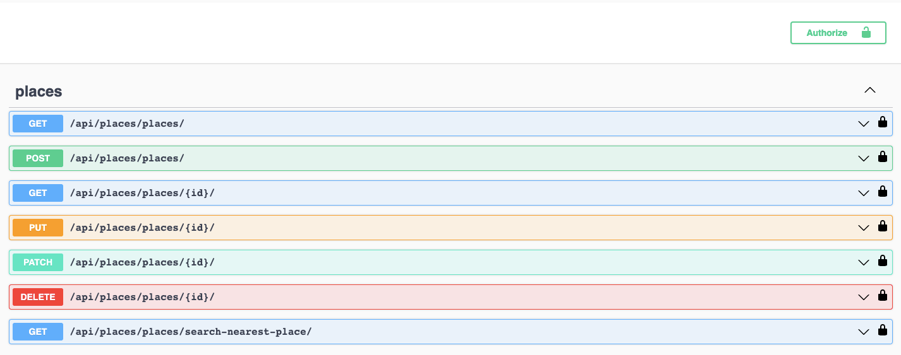

# Geospatial


If you want to use postgis with docker, you should write these commands
```shell
docker pull postgis/postgis
docker run --name (DB_NAME) -e POSTGRES_PASSWORD=(DB_PASSWORD) -p 5432:5432 -d postgis/postgis
docker exec -it (DB_NAME) psql -U (DB_USER)
CREATE DATABASE my_database;
```
but you can always use the documentation for an easy start https://postgis.net/documentation/getting_started/


API service for geospatial management written on DRF
```shell
git clone https://github.com/MaybeTI/Geospatial.git
python -m venv venv
venv\Scripts\activate (on Windows)
source venv/bin/activate (on macOS)
pip install -r requirements.txt
export DB_HOST=DB_HOST(your)
export DB_NAME=DB_NAME(your)
export DB_USER=DB_USER(your)
export DB_PASSWORD=DB_PASSWORD(your)
export SECRET_KEY=SECRET_KEY(your)
python manage.py migrate
python manage.py runserver
```


# Endpoints



